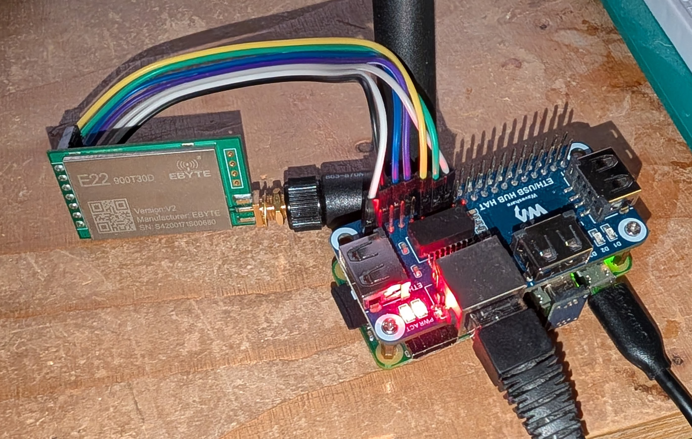

# E22xxxTxx Connector

A portable and lightweight software connector for the EBYTE E22 series (E22xxxTxxU/D) LoRa devices, supporting the USB module (Linux) and DIP module (Linux/ESP32) variants.

Tested and in use with E22-900T22U (USB), E22-900T22D (DIP) and E22-900T30D (DIP). It should work for the entire series: 230, 400 and 900 MHz frequency and 20, 22, 30 and 33 dBm (max) power variants. Specifications for the devices are in the `specs` directory.

The E22 is based on the Semtech SX1262. Also in the EBYTE family are the E220 (older Semtech SX1276) and E32 ("low cost" Semtech LLCC68). The E22 is the newer and more featured product. The E220 and E32 should also work with this connector with minor changes: the E220 lacks the NETID configuration field (making it one byte shorter) and repeater functionality; the E32 additionally lacks RSSI. More information on the family at [cdebyte.com](https://www.cdebyte.com/Module-SPISOCUART-SX12).

This is a greenfield implementation, not based upon any others. Take note of the [LICENSE](LICENSE) (Attribution-NonCommercial-ShareAlike).

## Builds

### Linux

The Linux build produces three targets:

- **e22900t22-usb** — command line tester for USB module.
- **e22900t22-dip** — command line tester for DIP module (requires `libgpiod`).
- **e22900t22tomqtt** — LoRa-to-MQTT gateway service (requires `libmosquitto-dev`), with udev rules and systemd service configuration.

Build with `make all` or individually with `make usb`, `make dip`, `make tomqtt`. The build enforces strict warnings (`-Werror`, `-Wpedantic`, etc.) and disables floating-point instructions on x86.

The `tomqtt` gateway supports config-file and command-line configuration for serial port, LoRa parameters (address, network, channel, packet size/rate, RSSI, LBT), MQTT broker connection, and topic routing. Topic routing can match on JSON keys or binary byte offsets to direct packets to different MQTT topics. Non-JSON packets can optionally be hex-encoded and wrapped as JSON (`json-convert` mode).

Install with `make install` which sets up the udev rules and systemd service.

### ESP32

The ESP32 build (in `esp32/`) has been tested under Arduino IDE and PlatformIO both using the Arduino framework, and also under native ESP-IDF. The example sends periodic JSON ping packets and reads channel RSSI.

## USB module

The device identifies as a CH340 serial interface (`1a86:7523`) and the udev rules (`90-e22900t22u.rules`) create a symlink at `/dev/e22900t22u`.

The connector enables the "Software Mode Switching" register setting to read/write configuration and product information over USB. This setting is disabled by default. Upon first use, the "touch switch" on the module needs to be held for more than 1.5 seconds to force the device into configuration mode before the connector starts. It will then enable and persist the setting so that no further manual intervention is required.

## DIP module

The DIP module is wired to the Pi expansion header at 3V3 TTL levels. The Pi needs `serial-console` to be disabled.

Note that the 30 dBm versions do run at 3V3 but are recommended to use 5V0 to achieve full TX power. If doing so using the Pi's 5V0, the GPIO logic levels may need to be level shifted (at least the input levels; the output levels from the Pi may be sufficient).

### Wiring (Pi → E22 DIP)

| Function | Pi Pin | GPIO |
|----------|--------|------|
| VCC | Pin 1 (3.3V) | — |
| GND | Pin 6 (GND) | — |
| TXD | Pin 10 (RXD) | GPIO 15 |
| RXD | Pin 8 (TXD) | GPIO 14 |
| M0 | Pin 11 | GPIO 17 |
| M1 | Pin 13 | GPIO 27 |
| AUX | Pin 15 | GPIO 22 |

