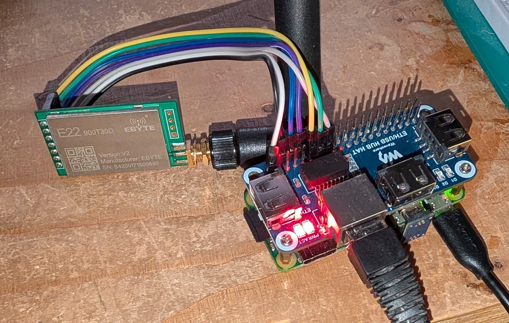

# E22xxxTxx Connector

A portable and lightweight software Connector for the EBYTE E22 series (E22xxxTxxU/D) LoRa devices, supporting the USB module (Linux) and DIP module (Linux/ESP32) variants.

Tested and in use with E22-900T22U (USB), E22-900T22D (DIP) and E22-900T30D (DIP). It should work for the entire series: 230, 400 and 900 MHz frequency and 20, 22, 30 and 33 dBm (max) power variants with only minor tweaks to settings (if any are needed). Specifications for the devices are in the `specs` directory.

The E22 is based on the Semtech SX1262. Also in the EBYTE family are the E220 (older Semtech SX1276) and E32 ("low cost" Semtech LLCC68). The E22 is the newer and more featured product. The E220 and E32 should also work with this Connector with minor changes: the E220 lacks the NETID configuration field (making it one byte shorter) and repeater functionality; the E32 additionally lacks RSSI. More information on the family at [cdebyte.com](https://www.cdebyte.com/Module-SPISOCUART-SX12).

This is a greenfield implementation, not based upon any others.

Take note of the [LICENSE](LICENSE) (Attribution-NonCommercial-ShareAlike).

## Builds

### Linux

The Linux build produces three targets:

- **e22900t22-usb** — command line tester for USB module.
- **e22900t22-dip** — command line tester for DIP module (requires `libgpiod`).
- **e22900t22tomqtt** — LoRa-to-MQTT gateway service (requires `libmosquitto-dev`), with udev rules and systemd service configuration.

Build with `make all` or individually with `make usb`, `make dip`, `make tomqtt`. The build enforces strict warnings (`-Werror`, `-Wpedantic`, etc.) and disables floating-point instructions on x86.

The `tomqtt` gateway supports config-file and command-line configuration for serial port, LoRa parameters (address, network, channel, packet size/rate, RSSI, LBT), MQTT broker connection, and topic routing. Topic routing can match on JSON keys or binary byte offsets to direct packets to different MQTT topics. Non-JSON packets can optionally be hex-encoded and wrapped as JSON (`json-convert` mode).

Install with `make install` which sets up the udev rules and systemd service.

### ESP32

The ESP32 build (in `esp32/`) has been tested under Arduino IDE and PlatformIO both using the Arduino framework, and also under native ESP-IDF. The example sends periodic JSON ping packets and reads channel RSSI.

## USB module

The device identifies as a CH340 serial interface (`1a86:7523`) and the udev rules (`90-e22900t22u.rules`) create a symlink at `/dev/e22900t22u`.

The Connector enables the "Software Mode Switching" register setting to read/write configuration and product information over USB. This setting is disabled by default. Upon first use, the "touch switch" on the module needs to be held for more than 1.5 seconds to force the device into configuration mode before the Connector starts. It will then enable and persist the setting so that no further manual intervention is required.

## DIP module

The DIP module is wired to the Pi expansion header at 3V3 TTL levels. The Pi needs `serial-console` to be disabled.

Note that the 30 dBm versions do run at 3V3 but are recommended to use 5V0 to achieve full TX power. If doing so using the Pi's 5V0, the GPIO logic levels may need to be level shifted (at least the input levels; the output levels from the Pi may be sufficient). I have only tested 3V3 configuration, not 5V0.

### Wiring (Pi → E22 DIP)

The DIP module presents seven signals (VCC, GND, TXD, RXD, M0, M1, AUX) on its 1x7 header. The compile-time defaults assumed by `e22900t22-dip` are:

| Function | Pi Pin       | BCM     |
| -------- | ------------ | ------- |
| VCC      | Pin 1 (3.3V) | —       |
| GND      | Pin 6 (GND)  | —       |
| TXD      | Pin 10 (RXD) | GPIO 15 |
| RXD      | Pin 8 (TXD)  | GPIO 14 |
| M0       | Pin 11       | GPIO 17 |
| M1       | Pin 12       | GPIO 18 |
| AUX      | Pin 7        | GPIO 4  |

The TXD/RXD pair is the Pi's hardware UART and is fixed by the kernel. The three GPIO assignments (M0, M1, AUX) are `#ifndef`-guarded in `e22900t22.c` and can be overridden from the Make command line without editing the source:

```sh
make dip CFLAGS_DEFINES="-DGPIO_M0=17 -DGPIO_M1=18 -DGPIO_AUX=4"
```

A photo of an example wiring follows. Since that earlier wiring, the pin usageh as been normalised to be co-located into a 2x6 IDC header block that neatly sits covers the top end of the Pi's header. Only 7 of the 12 pins are used.



#### GPIO conflicts to check before wiring

- **BCM4 (AUX default)** is the Pi's default 1-Wire GPIO. If `/boot/firmware/config.txt` has `dtoverlay=w1-gpio` enabled with no `gpio=` override, the w1 driver holds the line and `gpio_begin` will fail. Either remove the overlay or pin 1-Wire elsewhere with `dtoverlay=w1-gpio,gpio=N`.
- **BCM18 (M1 default)** is hardware PWM channel 0. Using it as a plain GPIO is fine but precludes hardware PWM0 elsewhere.
- **UART (BCM14/15)** requires `enable_uart=1` and the serial console removed from `cmdline.txt`. On Pi models where Bluetooth claims the PL011 by default (Pi 3, Pi 4, Pi Zero W/2W), add `dtoverlay=disable-bt` (or `miniuart-bt` if you want to keep BT on the mini-UART) so that `/dev/ttyAMA0` is the full UART on the GPIO header.

### Cable assembly with a 2x6 IDC block

A common build for a more permanent install is to terminate the seven LoRa wires into a 2x6 IDC housing that presses onto Pi header pins 1..12 as a single block. Five of the twelve positions stay unwired (those are 5V rails, the I2C pair, and a spare GND — none of which the module needs). The 2x6 form factor also leaves room beside the module for other peripherals if needed.

#### Topology

```
LoRa module breakout (7 leads, single row)
      |
      |  one 1x7 socket on the module end
      |
      v
7-wire bundle (other 5 positions of the 2x6 are unwired)
      |
      v
2x6 IDC block — presses onto Pi Zero header pins 1..12
```

#### LoRa module 1x7 lead order

| lead | signal | direction / notes                                  |
| ---- | ------ | -------------------------------------------------- |
| 1    | GND    | ground                                             |
| 2    | VCC    | 3V3 input                                          |
| 3    | AUX    | module status output (module → Pi, active-high)    |
| 4    | TXD    | module UART TX (module → Pi RX) — UART crossover   |
| 5    | RXD    | module UART RX (Pi TX → module) — UART crossover   |
| 6    | M1     | mode select 1 (Pi → module)                        |
| 7    | M0     | mode select 0 (Pi → module)                        |

Read the silkscreen on the module to confirm pin 1: if the labels run in reverse order, the breakout is upside-down and what looks like "lead 1" is actually lead 7.

#### 2x6 IDC block convention

```
                                          Column 1 ↓   Column 2 ↓
- 6 rows × 2 columns                         wire 1     wire 7
- "Wires 1..6"  = column 1, top → bottom     wire 2     wire 8
- "Wires 7..12" = column 2, top → bottom     wire 3     wire 9
- Column 1 sits over the INNER  / odd  Pi    wire 4     wire 10
  header column.                             wire 5     wire 11
- Column 2 sits over the OUTER  / even Pi    wire 6     wire 12
  header column.
- Top of block = lowest Pi pin on the block.
```

Pi orientation: top side (CPU visible) facing the viewer, SD-card slot at the top edge, GPIO header along the right edge. Pin 1 of the header sits at the top of the inner column and is identified by a SQUARE solder pad. Odd pins descend the inner column, even pins descend the outer column.

The IDC housing itself has no factory position-1 marker — mark it yourself (Sharpie dot, paint dab, scratch) on the side wall before crimping so it stays visible from both the wiring end and the mating end.

#### Wire table — 2x6 block on Pi side, pins 1..12

7 of the 12 positions are wired; 5 are BLANK (no crimp pin installed).

| wire | col/row | Pi pin | BCM | Pi signal     | → LoRa lead     | status |
| ---- | ------- | ------ | --- | ------------- | --------------- | ------ |
|  1   | c1 r1   |   1    | —   | 3V3           | lead 2 (vcc)    | wired  |
|  2   | c1 r2   |   3    |  2  | I2C SDA       | —               | BLANK  |
|  3   | c1 r3   |   5    |  3  | I2C SCL       | —               | BLANK  |
|  4   | c1 r4   |   7    |  4  | GPIO (AUX)    | lead 3 (aux)    | wired  |
|  5   | c1 r5   |   9    | —   | GND (spare)   | —               | BLANK  |
|  6   | c1 r6   |  11    | 17  | GPIO (M0)     | lead 7 (m0)     | wired  |
|  7   | c2 r1   |   2    | —   | 5V            | —               | BLANK  |
|  8   | c2 r2   |   4    | —   | 5V            | —               | BLANK  |
|  9   | c2 r3   |   6    | —   | GND           | lead 1 (gnd)    | wired  |
| 10   | c2 r4   |   8    | 14  | UART TXD      | lead 5 (rxd)    | wired (Pi TX → module RX) |
| 11   | c2 r5   |  10    | 15  | UART RXD      | lead 4 (txd)    | wired (Pi RX ← module TX) |
| 12   | c2 r6   |  12    | 18  | GPIO (M1)     | lead 6 (m1)     | wired  |

**BLANK positions: 2, 3, 5, 7, 8.**

**STOP — 5V hazard.** Positions 7 and 8 sit on the Pi's 5V rails (header pins 2 and 4). If either is wired to anything on the LoRa module, you will apply 5V to a 3V3-only input and destroy it. Confirm by inspection that those positions are empty before pressing the block onto the Pi.

#### Assembly procedure

1. Cut 7 wires, 100–150 mm. Strip and crimp both ends — 1x7 housing pins at the module end, 2x6 IDC pins at the Pi end. Do NOT crimp wires for 2x6 positions 2, 3, 5, 7, 8 — those stay empty.

2. Mark position 1 on the 2x6 housing side wall (it has no factory marker).

3. Insert wires into the 2x6 per the wire table above. Use the wiring-end view with the position-1 mark in the top-left corner. Verify the UART crossover twice: module TXD goes to 2x6 position 11, module RXD goes to 2x6 position 10. If swapped, the link powers up but never carries data.

4. Power off the Pi and disconnect anything attached to the header.

5. Hold the 2x6 block wiring-end UP (wires pointing toward you, mating end facing down). Rotate so the position-1 mark is at the top-inner corner of your view — directly above Pi pin 1 (the square solder pad).

6. Lower onto Pi pins 1..12 evenly. Press until the housing seats flat against the header shoulder.

#### Seating diagram

```
           [ SD CARD SLOT — top edge of board ]
         ┌───────────────────────────────────────┐
         │                                       │
         │                inner    outer         │
         │                col      col           │
         │                (odd)    (even)        │
         │              ┌───────────────┐
         │   row  1     │ [L1*]   [L7-] │ ← pin 1 (▣) / pin 2     ─┐
         │   row  2     │ [L2-]   [L8-] │ ← pin 3  / pin 4         │
         │   row  3     │ [L3-]   [L9*] │ ← pin 5  / pin 6         │  LoRa
         │   row  4     │ [L4*]   [L10*]│ ← pin 7  / pin 8         │  2x6
         │   row  5     │ [L5-]   [L11*]│ ← pin 9  / pin 10        │
         │   row  6     │ [L6*]   [L12*]│ ← pin 11 / pin 12       ─┘
         │              └───────────────┘
         │   rows 7..20   [◯]      [◯]   ← pins 13..40 unused (exposed)
         │                                       │
         └───────────────────────────────────────┘
           [ USB / HDMI / power — bottom edge ]

  Legend:
    [Ln*]  wire n, WIRED       (7 wires:  1, 4, 6, 9, 10, 11, 12)
    [Ln-]  wire n, BLANK       (5 blanks: 2, 3, 5, 7, 8)
    [◯]    exposed Pi header pin
    [▣]    pin 1 (square solder pad — orientation anchor)
```

#### Pre-power checklist

Tick every box before applying power:

- [ ] 2x6 positions 2, 3, 5, 7, 8 are EMPTY (no crimp pin installed).
- [ ] **STOP-RECHECK:** positions 7 and 8 are empty — 5V rails must stay disconnected.
- [ ] Continuity 1x7 lead 4 (TXD) ↔ 2x6 position 11 → 0 Ω
- [ ] Continuity 1x7 lead 5 (RXD) ↔ 2x6 position 10 → 0 Ω  (UART crossover — verify both)
- [ ] Continuity 1x7 lead 1 (GND) ↔ 2x6 position 9  → 0 Ω
- [ ] Continuity 1x7 lead 2 (VCC) ↔ 2x6 position 1  → 0 Ω
- [ ] After seating: 2x6 block covers Pi pins 1..12; position-1 corner aligned with the square pad.
- [ ] Resistance between any 5V pin on the Pi header and any pin on the 2x6 housing reads OPEN (no short into 5V).
- [ ] Resistance between 3V3 (Pi pin 1) and GND (Pi pin 6) reads OPEN or > 1 kΩ (no power-rail short).
